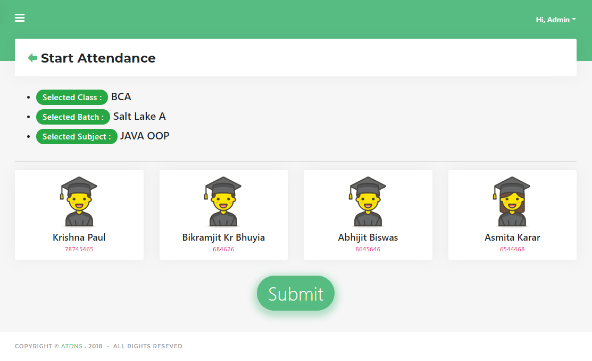

# attendance-management-system-laravel
It's an attendance management system made with php Laravel. In which user(teacher) can add class batch subject students then can take attendance. After that they can export the attendance as CSV format.

------------------------------------

Language : PHP

Framework : Laravel 4.2

------------------------------------

# Screenshots

Take Attendance page

------------------------------------

First create database name 'atdns'

then import the database form DATABASE folder.

------------------------------------

email : admin@gmail.com

pass: admin1234
